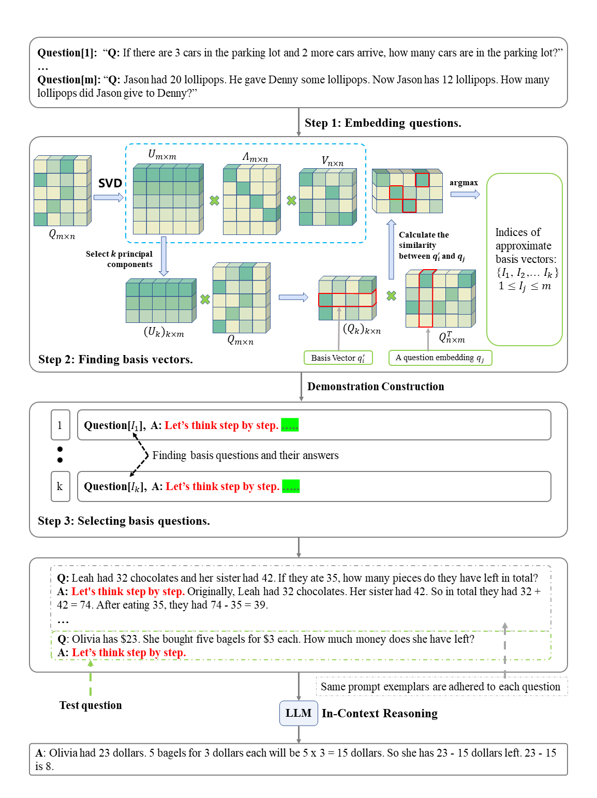

# Prompt Space Optimizing Few-shot Reasoning Success with Large Language Models

This repository contains the official implementation of our method proposed in [Prompt Space Optimizing Few-shot Reasoning Success with Large Language Models](https://arxiv.org/abs/2306.03799)

## Experimental results

* Accuracy (%) comparison of Prompt Space w/o CoT-Zero (gpt-turbo-0125) with different amounts of basis questions on ten reasoning datasets. Ten benchmark datasets contain three categories, including arithmetic reasoning, commonsense reasoning, and symbolic reasoning

| # of Basis                 | AddSub   | MultiArith | SingleEq | AQUA-RAT | SVAMP    | GSM8K    | CSQA     | STQA     | Letter   | Coin      | Avg      |
| -------------------------- | -------- | ---------- | -------- | -------- | -------- | -------- | -------- | -------- | -------- | --------- | -------- |
| 1.0                        | 87.1     | 69.7       | 84.1     | 26.0     | 70.8     | 19.0     | 77.4     | 46.0     | 3.2      | 15.4      | 49.9     |
| 2.0                        | 87.1     | 82.5       | 86.8     | 29.5     | 70.4     | 24.8     | 77.7     | 45.1     | 2.8      | 57.2      | 56.4     |
| 3.0                        | 89.1     | 84.3       | 88.4     | 32.3     | 74.2     | 23.2     | 78.2     | 52.8     | 4.2      | 41.8      | 56.9     |
| 4.0                        | 89.4     | 83.0       | 88.8     | 31.9     | 74.5     | 25.7     | 78.7     | 55.5     | 3.4      | 30.6      | 56.1     |
| 5.0                        | 89.1     | 83.8       | 88.4     | 30.7     | 75.4     | 24.9     | 78.7     | 56.2     | 4.4      | 51.8      | 58.3     |
| 6.0                        | 89.6     | 83.7       | 88.2     | 31.9     | 75.6     | 25.9     | 79.0     | 61.3     | 4.2      | 63.8      | 60.3     |
| 7.0                        | 88.6     | 84.5       | 88.6     | 29.9     | 75.6     | 25.4     | 79.1     | 60.3     | 4.0      | 59.0      | 59.5     |
| 8.0                        | 88.4     | 83.7       | 88.8     | 30.7     | 75.5     | 25.2     | **80.0** | 62.0     | 3.8      | 61.2      | 59.8     |
| 9.0                        | 89.9     | 86.3       | 88.4     | 30.3     | 74.7     | 25.8     | 79.9     | 61.4     | 5.2      | 60.2      | 60.2     |
| 10.0                       | **89.6** | 85.8       | 88.2     | 29.9     | 75.0     | 25.5     | 79.0     | 62.8     | 4.2      | 60.6      | 60.1     |
| Best results               | **89.9** | 86.3       | 88.8     | 32.3     | 75.6     | 25.9     | **80.0** | 62.8     | 5.2      | 63.8      | 61.1     |
| gpt-3.5-turbo-latest (Sep) | 84.4     | **95.6**   | **94.2** | **55.6** | **83.6** | **78.4** | 74.4     | **62.9** | **76.9** | **100.0** | **80.6** |

* Accuracy (%) comparison of Prompt-Space-CoT with different amounts of basis questions on ten reasoning datasets. Ten benchmark datasets contain three categories, including arithmetic reasoning, commonsense reasoning, and symbolic reasoning.

| # of Basis                 | AddSub   | MultiArith | SingleEq | AQUA-RAT | SVAMP    | GSM8K    | CSQA     | STQA     | Letter   | Coin      | Avg      |
| -------------------------- | -------- | ---------- | -------- | -------- | -------- | -------- | -------- | -------- | -------- | --------- | -------- |
| 1.0                        | 39.7     | 58.8       | 41.7     | 15.0     | 34.3     | 24.7     | 72.2     | 44.6     | **84.4** | 61.8      | 47.7     |
| 2.0                        | 80.0     | 94.3       | 91.9     | 32.3     | 35.6     | 69.3     | 74.4     | 59.7     | 73.0     | 88.0      | 69.9     |
| 3.0                        | 85.1     | 96.2       | 92.3     | 36.2     | 77.1     | 71.1     | 74.8     | 61.7     | 76.0     | **100.0** | 77.1     |
| 4.0                        | 86.6     | 96.8       | 92.5     | 40.6     | 80.4     | 75.7     | 74.0     | 61.9     | 74.2     | 99.6      | 78.2     |
| 5.0                        | 86.1     | 96.8       | 92.5     | 43.3     | 81.7     | 76.1     | 72.5     | 61.6     | 75.6     | 100.0     | 78.6     |
| 6.0                        | 86.6     | 97.3       | 91.7     | 39.8     | 82.5     | 75.6     | 75.6     | 62.5     | 74.4     | 97.8      | 78.4     |
| 7.0                        | 86.1     | 98.0       | 91.9     | 48.8     | 82.1     | 76.6     | 74.1     | 63.6     | 74.0     | 84.2      | 78.0     |
| 8.0                        | **87.9** | **98.8**   | 92.1     | 47.6     | 81.0     | 77.9     | 74.1     | 62.5     | 79.6     | **100.0** | 80.2     |
| 9.0                        | 87.8     | 97.5       | 92.1     | 45.3     | 82.1     | 76.6     | 74.3     | 64.4     | 76.2     | 99.4      | 79.6     |
| 10.0                       | 87.6     | 97.8       | 91.5     | 45.3     | 82.6     | 76.9     | 74.4     | 64.4     | 77.6     | 99.0      | 79.7     |
| Best results               | **87.9** | **98.8**   | 92.5     | 48.8     | 82.6     | 77.9     | 75.6     | 64.4     | 84.4     | **100.0** | 81.3     |
| gpt-3.5-turbo-latest (Sep) | 87.7     | 97.0       | **93.1** | **57.2** | **83.1** | **80.7** | **76.9** | **68.0** | 76.1     | 100.0     | **82.0** |

## Introduction



**Abstract**:Prompt engineering is an essential technique for enhancing the abilities of large language models (LLMs) by providing explicit and specific instructions. It enables LLMs to excel in various tasks, such as arithmetic reasoning, question answering, summarization, relation extraction, machine translation, and sentiment analysis. Researchers have been actively exploring different prompt engineering strategies, such as Chain of Thought (CoT), Zero-CoT, and In-context learning. However, an unresolved problem arises from the fact that current approaches lack a solid theoretical foundation for determining optimal prompts. To address this issue in prompt engineering, we propose a new and effective approach called Prompt Space. Our methodology utilizes text embeddings to obtain basis vectors by matrix decomposition, and then constructs a space for representing all prompts. Prompt Space significantly outperforms state-of-the-art prompt paradigms on ten public reasoning benchmarks. Notably, without the help of the CoT method and the prompt "Let's think step by step", Prompt Space shows superior performance over the few-shot method. Overall, our approach provides a robust and fundamental theoretical framework for selecting simple and effective prompts. This advancement marks a significant step towards improving prompt engineering for a wide variety of applications in LLMs.

## Requirements

Python>=3.8
```
pip install torch==1.8.2+cu111 torchtext==0.9.2 -f https://download.pytorch.org/whl/lts/1.8/torch_lts.html
pip install -r requirements.txt
pip install sentence_transformers
pip install matplotlib
```

## Datasets

Download the datasets from the following:

```
Url_1: https://github.com/kojima-takeshi188/zero_shot_cot/tree/main/dataset
Url_2: https://github.com/kojima-takeshi188/zero_shot_cot/tree/main/log
```

## Instructions

### Step 1. Construct basis:

```shell
python run_demo.py --task gsm8k --pred_file log/gsm8k_zero_shot_cot.log --demo_save_dir demos/gsm8k/base_8 --encoder all-MiniLM-L6-v2 --question_save_dir question/gms8k --num_basis 8
# Important parameter description.
# --task : Task name
# --pred_file: The path of the GSM8k dataset, which is the data downloaded from Url_2
# --demo_save_dir : save path
# --encoder: The model we use to extract text embedding.
# --num_basis: How many basis questions do we need to select?
```
The selected basis questions of GSM8k are presented as follows.


### Step 2. Run inference:

Use the prompt we previously selected to perform the inference：

```shell
python run_inference.py --dataset gsm8k --demo_path demos/gsm8k/base_8 --output_dir experiment/gsm8k/base_8_prompt_space --method prompt_space
python run_inference.py --dataset gsm8k --demo_path demos/gsm8k/base_8 --output_dir experiment/gsm8k/base_8_prompt_space_cot --method prompt_space_cot
python run_inference.py --dataset gsm8k --demo_path demos/gsm8k/base_8 --output_dir experiment/gsm8k/base_8_prompt_space_cot_zero --method prompt_space_cot_zero
```

## BibTeX

If this repository has been helpful to you, please cite as follows：

```
@article{shi2023prompt,
  title={Prompt Space Optimizing Few-shot Reasoning Success with Large Language Models},
  author={Shi, Fobo and Qing, Peijun and Yang, Dong and Wang, Nan and Lei, Youbo and Lu, Haonan and Lin, Xiaodong},
  journal={arXiv preprint arXiv:2306.03799},
  year={2023}
}
```


## Acknowledgements

Our method is a general technique for enhancing the abilities of large language models (LLMs) by providing explicit and specific instructions, which is builded upon several solid works. Thanks to [Auto-CoT](https://github.com/amazon-science/auto-cot) and [zero_shot_cot](https://github.com/kojima-takeshi188/zero_shot_cot) for their wonderful work and codebase!

